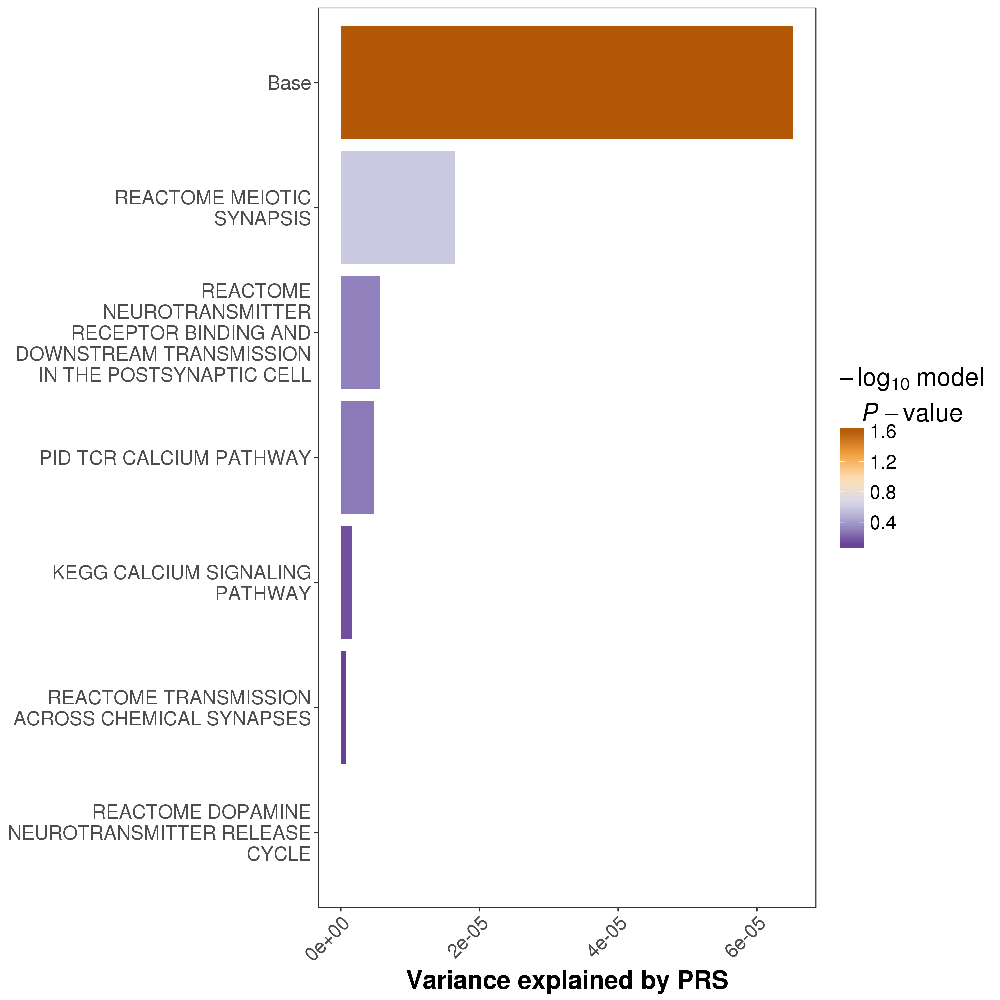

# Input Data
## MSigDB
One simple way to obtain gene sets or pathway is through the [MSigDB](http://software.broadinstitute.org/gsea/msigdb/).
After registration in [here](http://software.broadinstitute.org/gsea/login.jsp;jsessionid=EEFB5FCE8B9B285B2F789B46B388A647#msigdb), you can download different gene sets curated by the Broad Institute.
Alternatively, you can also generate your own gene sets in the GMT format:

<pre>
[Set A] [Gene 1] [Gene 2] ...
[Set B] [Gene 1] [Gene 2] ...
</pre>

Sometimes, the MSigDB file might store the URL for the gene set on the second column

<pre>
[Set A] [url for set A] [Gene 1] [Gene 2] ...
</pre>

And PRSet can properly handle that.

## Gene GTF
As MSigDB file does not contain the genome boundary of the genes within the gene set,
one must also provide a GTF file. A GTF file contains the genome boundary of the genetic
elements within the human genome and PRSet can use the information from GTF to determine if
a SNP falls within a specific gene.
One can download the GTF file file Human (Genome build GTCh38.p7) [here](ftp://ftp.ensembl.org/pub/release-86/gtf/homo_sapiens).

PRSet will look for any regions with feature  of **exon**, **gene**, **protein_coding** or **CDS** (*case sensitive*).
Any genomic regions without these features will be ignored.
Alternatively, you can specify the features using the `--feature` command.

!!! note

    For those who are unfamiliar, different version of the genome might differ slightly in their coordinates. Therefore it is vital to ensure all the files are originated from the same genome build

## Bed Files
In addition, PRSet also accept bed file(s) as an input.

!!! important

    A bed file **must** contain a minimum of 3 columns:

1. **chrom** - The name of the chromosome (e.g. chr3, chrY, chr2_random) or scaffold (e.g. scaffold10671).
2. **chromStart** - The starting position of the feature in the chromosome or scaffold. The first base in a chromosome is numbered 0.
3. **chromEnd** - The ending position of the feature in the chromosome or scaffold. The chromEnd base is not included in the display of the feature. For example, the first 100 bases of a chromosome are defined as chromStart=0, chromEnd=100, and span the bases numbered 0-99.

PRSet will read in any number of bed files (comma separated) and use the file names as the name of the gene set.

!!! note

    An annoying feature of bed file is that it starts with 0 whereas for example, the plink formats starts the coordinates at 1. So do remember to -1 from the region start when you build your own bed file from scratch.

# P-value Threshold and Proxy Clumping

# Options
## Proxy PRSet
One complication in PRSet is the definition of SNP membership.
The default option of PRSet is to only include SNPs that are physically within the target region.
However, it is also likely for SNPs outside the region to influence functions of the set.
Therefore we provide the `--proxy` option. Essentially, this provide a soft cutoff to SNP membership.
For example, when user define `--proxy 0.8`, if LD between SNP A and SNP B is more than 0.8, then SNP A will be considered to be within the same regions as SNP B and vice versa.

## P-value thresholding
By default, PRSet do not perform p-value thresholding and will simply calculate the set based PRS at P-value threshold of 1. 
This is because it is unclear whether the set is associated with the phenotype when the best-threshold contained only a small portion of SNPs within the gene sets.
If you wish to perform p-value thresholding with PRSet, you will need to specify any of the parameters related to p-value thresholding, i.e. `--interval`, `--lower`, `--upper`, `--fastscore` or `--bar-levels`.

# Set Based Association
A challenge in Set base analysis is to obtain a competitive p-value, which indicates the level of enrichment, as opposed to the self-contained p-value which indicates the level of association. 
To obtain a competitive p-value, PRSet can perform a permutation analysis. 
Briefly, for a set containing $N$ SNPs, PRSet will construct a null set by randomly selecting $N$ SNPs from the background (default is the genic region). 
A null p-value is then obtained by performing an association between the PRS of the null set with the phenotype. You can specify the number of permutation by `--set-perm`

# Output Data

## PRS model-fit
A file containing the PRS model fit across thresholds is named **[Name].prsice**, where **[Name]** is the
output prefix name as specified by `--out` this is stored as

Name of Set, Threshold, R2, P-value, Coefficient, Standard Error, and Number of SNPs at this threshold

## Scores for each individual
A file containing PRS for each individual at the best-fit PRS named

**[Name].best** is provide.
This file has the format of:

FID,IID, In Regression, PRS at best threshold for Set 1, PRS at best threshold for Set 2, ...

Where the has phenotype column indicate whether the sample contain all
the required phenotype for PRSice analysis (e.g. Samples with missing
phenotype/covariate will not be included in the regression.
These samples will be indicated as "No" under the in regression column)

If `--all` option is used, a file named

**[Name].all.score** is also generated

Please note, if `--all` options is used, the PRS for each individual at all threshold will be given.
In the event where the target sample size is large and a lot of threshold are tested, this file can be large.
This is especially true when large number of gene sets were provided.

!!! note

    PRSice also supports multiple phenotypes for target data.
    All output prefix will change to [Name].[Pheno] where [Pheno]
    is the name of the phenotype. 
    For more details on the options used to implement this, see
    [here](step_by_step.md#phenotype-files).

## Summary Information
Information of the best model fit of each phenotype and gene set is stored in [Name].summary.
The summary file contain the following fields:

1. **Phenotype** - Name of Phenotype
2. **Set** - Name of Gene Set
3. **Threshold** - Best P-value Threshold
4. **PRS.R2** - Variance explained by the PRS. If prevalence is provided, this will be adjusted for ascertainment
5. **Full.R2** - Variance explained by the full model (including the covariates). If prevalence is provided, this will be adjusted for ascertainment
6. **Null.R2** - Variance explained by the covariates. If prevalence is provided, this will be adjusted for ascertainment
7. **Prevalence** - Population prevalence as indicated by the user. "-" if not provided.
8. **Coefficient** - Regression coefficient of the model. Can provide insight of the direction of effect.
9. **P** - P value of the model fit
10. **Num_SNP** - Number of SNPs included in the model
11. **Empirical-P** - Only provided if permutation is performed. This is the empirical p-value and should account for multiple testing and over-fitting
12. **Competitive-P** - Only provided if set permutation is performed. This is the competitive p-value and should measure the enrichment of signal of the gene set

## Multi-Set Plot
When the `--multi-plot <N>` option is set, the results of the top *N* gene sets will be plotted.
An example of the multi-set plot is:

## Other Figures
The default behaviour of PRSet is to only plot the High-resolution plot, bar-plot and the quantile plot
for the "Base" data. You can change this behaviour by using the `--plot-set` option.

## Log File
We value reproducible research. Therefore we try our best to make replicating PRSice run easier.
For every PRSice run, a log file named **[Name].log** is generated which contain the all the commands
used for the analysis and information regarding filtering, field selected etc.

This also allow users to quickly identify problems in the input dataset.
