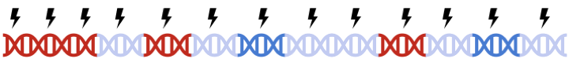
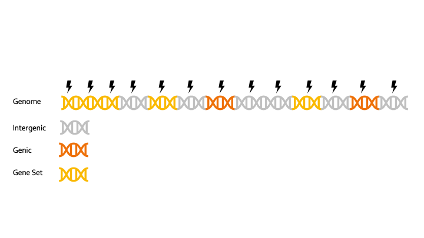

# Clumping in PRSet
In PRSice-2, clumping is performed to account for linkage disequilibrium (LD) between SNPs.
However, when performing set based analysis, special care are required to perform clumping. 
Take the following as an example:
Assume that:

- Light Blue fragments are the intergenic regions
- Dark Blue fragments are the genic regions
- Red fragments are the gene set regions
- SNPs are represented as thunder bolt, with the "index" SNP in clumping denoted by the green thunderbolt

If we simply perform a genome wide clumping, we might remove all SNPs residing within the gene set of interest, 
reducing the signal:

Therefore, to maximize signal within each gene set, we must perform clumping for each gene sets separately:

this can be a tedious process and are prone to error. 

To speed up clumping, PRSice-2 adopt a "*capture the flag*" system.

Each SNPs contains a flag to represent their gene set membership. 
If a SNP is a member for the set, it will have a flag of 1, otherwise it will have a flag of 0.
For example: 

| SNP | Set A | Set B | Set C | Set D |
| -----------------|:----:|:----:|:----:|:----:|
| SNP 1 | 1 | 0 | 1 | 1| 
| SNP 2 | 0 | 0 | 1 | 1| 
| SNP 3 | 1 | 1 | 0 | 1| 

If we use SNP 1 as the index SNP, then after clumping, we will have 

| SNP | Set A | Set B | Set C | Set D |
| -----------------|:----:|:----:|:----:|:----:|
| SNP 1 | 1 | 0 | 1 | 1| 
| SNP 2 | 0 | 0 | 0 | 0| 
| SNP 3 | 0| 1 | 0 | 0| 

which removes SNP 2, but will retain SNP 3. This allow us to achieve set based clumping by only performing a single pass genome wide clumping. 
