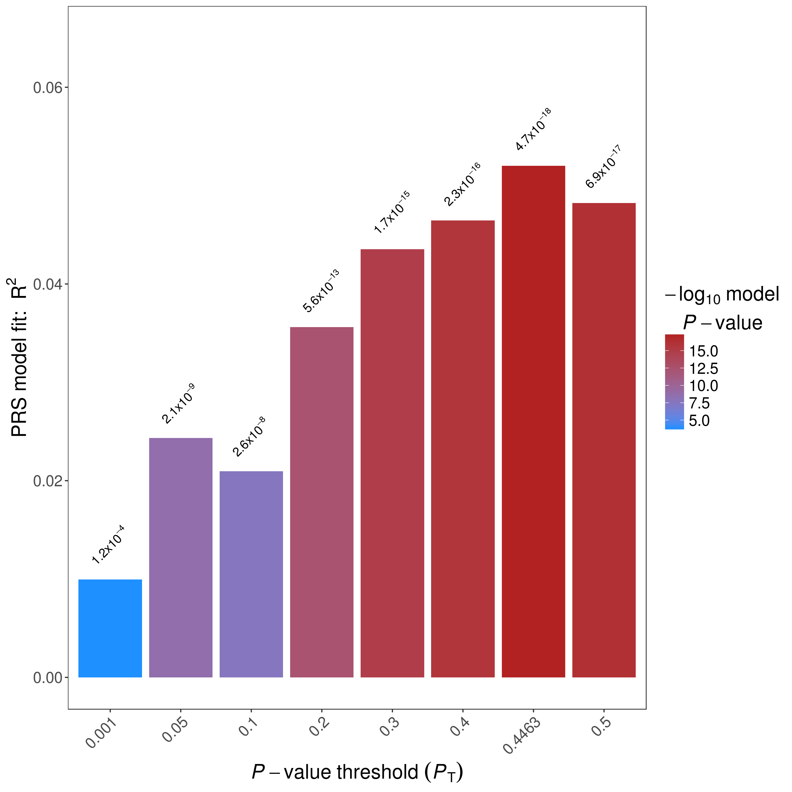
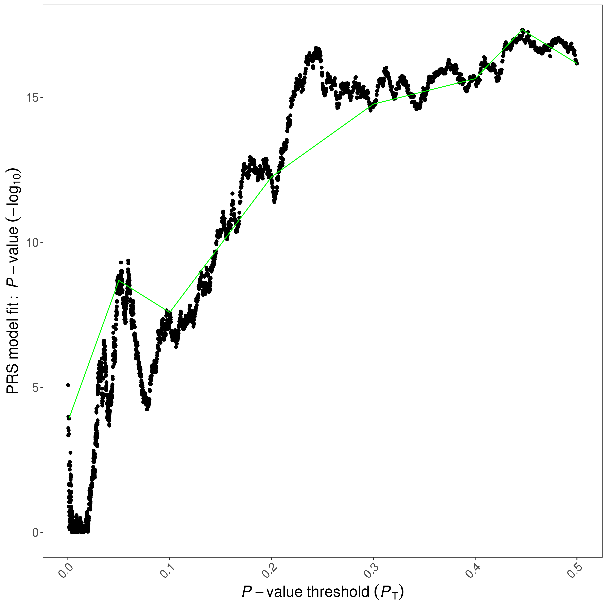
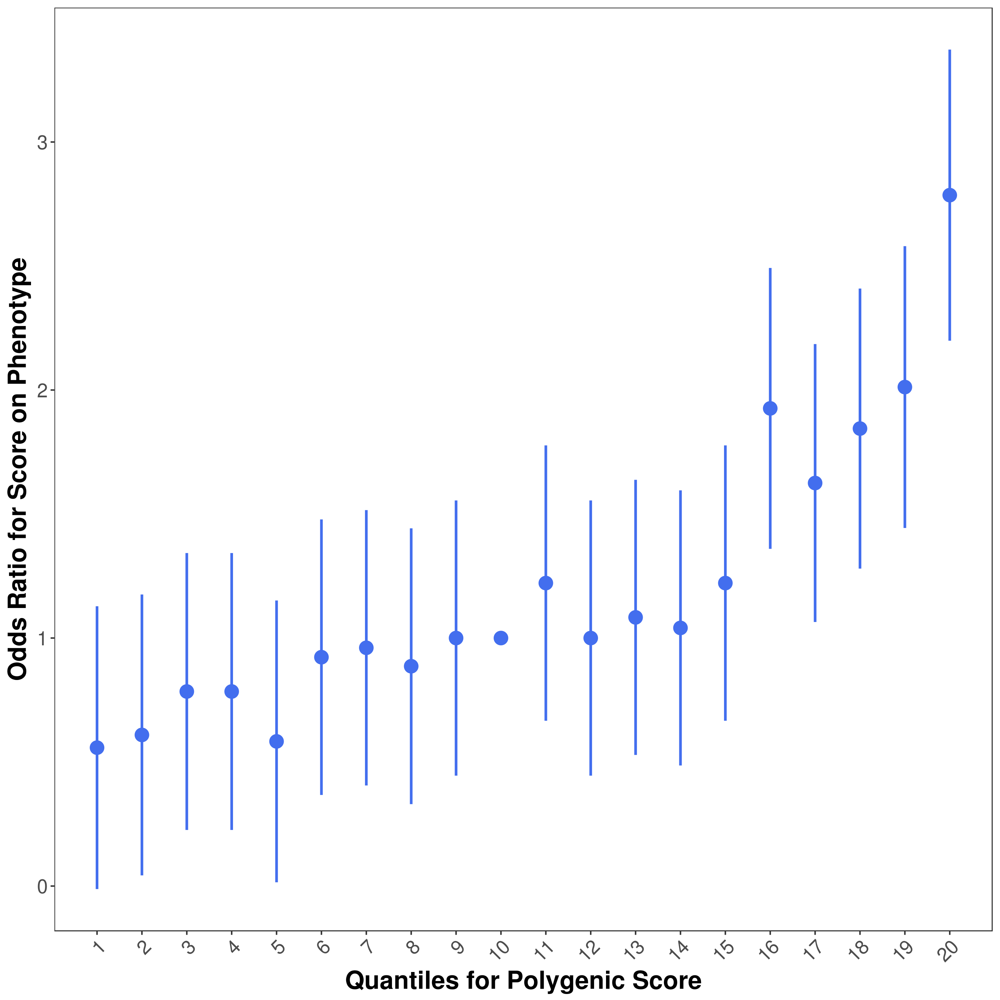

# Background
You will need to have basic understanding of Genome Wide Association Studies (GWAS) in order to be able to 
perform Polygenic risk score (PRS) analyses.
If you are unfamiliar with GWAS, you can consider reading [this paper](https://www.ncbi.nlm.nih.gov/pubmed/29484742).


## Input Data
Here, we briefly discuss different input files required by PRSice:

### Base Dataset
Base (i.e. GWAS) data must be provided as a whitespace delimited file containing association analysis results for SNPs on the base phenotype.
PRSice has no problem reading in a gzipped base file (need to have a **.gz** suffix).

If PLINK output is used, then please make sure there is a column for the effective allele (A1) and specify it with `--A1` option. 

If your base data follows other formats, then the column headers can be provided using the `--chr`, `--A1`, `--A2`, `--stat`, `--snp`, `--bp`, `--pvalue` options

!!! important

    PRSice requires the base file to contain information of the effective allele (`--A1`), effect size estimates (`--stat`), p-value for association (`--pvalue`), and the SNP ID (`--snp`).

If the input file does not contain a column header, the column can be specified using their index (start counting from 0) with the `--index` flag.

For example, with the following input format:

|SNP|CHR|BP|A1|A2|OR|SE|P|
|:-:|:-:|:-:|:-:|:-:|:-:|:-:|:-:|
|rs3094315|1|752566|A|G|0.9912|0.0229|0.7009|
|rs3131972|1|752721|A|G|1.007|0.0228|0.769|
|rs3131971|1|752894|T|C|1.003|0.0232|0.8962|

the parameters can either be

``
--snp SNP --chr CHR --bp BP --A1 A1 --A2 A2 --stat OR --pvalue P
``

or

``
--snp 0 --chr 1 --bp 2 --A1 3 --A2 4 --stat 5 --pvalue 7 --index
``

Strand flips are automatically detected and accounted for.

If an imputation info score or the minor allele frequencies (MAF) are also included in the file, 
`--base-info <Info Name>,<Info Threshold>` and `--base-maf <MAF Name>,<MAF Threshold>` can be used to filter
SNPs based on their INFO score and MAF respectively.

For binary trait base file, SNPs can be filtered according to the MAF in case and control separately using

```
--base-maf <Name for Control>,<Threshold for Control>:<Name for Case>,<Threshold for Case>
```

By default, PRSice will look for the following column names automatically from the base file header if `--index` was not provided or if the column name of the specific arguement(s) were not provided:
> CHR, BP, A1, A2, SNP, P, INFO (case sensitive) and OR / BETA (case insensitive)

`--no-default` can be used to disable all the defaults of PRSice.

!!! Note
    PRSice will ignore any columns that were not found in the base file (e.g. If`--A2 B` is specified but none of the column header is *B*,  then PRSice will treat it as if no *A2* information is presented)

### Target Dataset
Currently two different target file format is supported by PRSice:

#### PLINK Binary
A target dataset in PLINK binary format must consist of three files: **.bed**, **.bim**, and a **.fam** file - where bed contains the compressed genotype data, bim contains the SNP information and fam contains the family information. Currently only SNP major PLINK format are supported  (default output of the latest PLINK program).

The **.bed** and **.bim** file must have the same prefix.

If the **.fam** file follow a different prefix from the **.bed** and **bim** file, it can be specified using
```
--target <bim bed prefix>,<fam file>
```

!!! warning

    The fam file MUST contains the correct number of samples or PRSice will crash

Missing phenotype data can be coded as NA, or -9 for binary traits and NA for quantitative traits.
!!! Note

    -9 will **NOT** be considered as missing for quantitative traits

If the binary file is separated into individual chromosomes, then an # can be used to specify the location of the chromosome number in the file name.
PRSice will automatically substitute # with 1-22

i.e. If the files are chr1.<bed|bim|fam>,chr2.<bed|bim|fam>,...,chr22.<bed|bim|fam>, just use
```
--target chr#
```

!!! Note

    Chromosome number substitution will not be performed on the external fam file as the fam file should be the same for all chromosomes. 

Alternatively, if your PLINK files do not have a unified prefix, you can use `--target-list` to provide a file containing all
prefix to PRSice. 

!!! Note

    **.pgen** files are not currently supported

#### BGEN
PRSice currently support BGEN v1.1 and v1.2. To specify a BGEN file, simply add the `--type bgen` or `--ld-type bgen` to the PRSice command

!!! Note

    In theory, we can support BGEN v1.3, but that will require us to include zstd library, developed by facebook. 
    You can enable the support by including the zstd library and changing the *bgen_lib* files.

As BGEN does not store the phenotype information and sometime not even the sample ID, you **must** provide
a phenotype file (`--pheno`). Alternatively, if you have a sample file containing the phenotype information, you can 
provide it with

```
--target <bgen prefix>,<sample file>
```

!!! Note

    The sample file is required even if `--no-regress` is set as the sample ID is required for output. This requirement might be losen in future versions

With BGEN input, a number of PRSice options become effective:

- `--hard`: Normally, with BGEN format, PRS is calculated using the dosage information.
But hard-thresholding can be performed by using the `--hard` option. SNPs will then coded as the genotype (0,1 or 2) and filtered
according to threshold set by `--hard-thres`. If no such genotype is presented, the SNP will be
coded as missing

- `--hard-thres`: A hardcall is saved when the distance to the nearest hardcall is less than the hardcall threshold. See [here](command_detail.md#dosage) for more detail. 

To perform clumping on BGEN file, we need to repeatly decompress the genotype dosage and convert them into PLINK binary format. 
To speed up the clumping process, you can allow PRSice to generate a large intermediate file, containing the hard
coded genotypes in PLINK binary format by using the `--allow-inter` option.

### Phenotype files
An external phenotype file can be provided to PRSice using the `--pheno` parameter. 
This must be a tab / space delimited file and missing data **must** be represented by either `NA` or `-9` (only for binary traits).
The first two column of the phenotype file should be the FID and the IID, or when
`--ignore-fid` is set, the first column should be the IID.
The rest of the columns can be the phenotype(s).

To specify a trait within the phenotype file, the column name for the trait can be specified using
`--pheno-col`, providing that the phenotype file contains a header.
Multiple column name can be provided via a comma separated
list: e.g. `--pheno-col A,B,C,D`. Trait(s) not found within the phenotype file will
be automatically skipped.

!!! important

    The column name(s) should not contain *space* nor *comma*

!!! note

    When more than one traits are provided, the column name will be appended to
    the output prefix.


## LD reference
When the target sample is small (e.g. < 500 samples), an external reference panel can be used
to improve the LD estimation for clumping.

The LD reference follows the same notion as the target dataset. Simply use
```
--ld <LD refernce>
```
to specify your LD reference panel file and `--ld-type` to specify the format

When a LD reference file is not provided and `--no-clump` is not specified, the target file
will be used as the LD reference panel

!!! Important

    Any parameters with the `--ld` prefix will only work on the file specified by the `--ld` parameter.
    That is, if a LD reference file is not provided, none of the `--ld-*` options will be used.
    If a different set of filtering is to be perforemd on the target file when performing LD calculation, it must
    be provided separately to the `--ld` parameter

    e.g. `--target <target> --ld <target> --keep <samples for PRS> --ld-keep <samples for LD>`

!!! Note

    BGEN file will always be hard coded when used to estimate the LD


## Clumping
By default, PRSice will perform Clumping to remove SNPs that are in LD with each other.
Similar to PLINK, the r^2^ values computed by PRSice are based on maximum likelihood haplotype frequency estimates.

Both cases and controls are included in the LD calculation. 
Alternatively, a combination of `--ld` and `--ld-keep`/`-ld-remove` can be used to restrict LD calculation in control samples. 

Clumping parameters can be changed by using the `--clump-kb`, `--clump-r2` and `--clump-p` option.
Clumping can be disabled using `--no-clump`

## PRS calculation
PRSice allow different genetic models to be specified (e.g. add, dom, het, rec), and the polygenic score
of each of those are calculated differently

Assuming $S$ is the summary statistic for the effective allele and $G$ is the number
of the effective allele observed, then the main difference between the models is
how the genotypes are coded:

For additive model (add)

$$
G = G
$$

For dominant model (with respect to the effective allele of the base file)

$$
    G =
  \begin{cases}
    0 & \text{if $G$ = 0} \\
    1 & \text{otherwise}
  \end{cases}
$$


For recessive model (with respect to the effective allele of the base file)

$$
    G =
  \begin{cases}
    1 & \text{if $G$ = 2} \\
    0 & \text{otherwise}
  \end{cases}
$$


For heterozygous model

$$
    G =
  \begin{cases}
    1 & \text{if $G$ = 1} \\
    0 & \text{otherwise}
  \end{cases}
$$

Then depending on the `--score` option, the PRS is calculated as (assuming $M_j$ is the number of Alleles included in the PRS of the $j^{th}$ individual)

`--score avg` (default):
$$
    PRS_j = \sum_i{\frac{S_i\times G_{ij}}{M_j}}
$$

`--score sum`:
$$
    PRS_j = \sum_i{S_i\times G_{ij}}
$$

`--score std`:
$$
    PRS_j = \frac{\sum_i({S_i\times G_{ij}}) - \text{Mean}(PRS)}{\text{SD}(PRS)}
$$


`--score con-std`:
$$
    PRS_j = \frac{\sum_i({S_i\times G_{ij}}) - \text{Mean}(PRS in control)}{\text{SD}(PRS in control)}
$$
Sometimes, sample can have missing genotype. 
The `--missing` option is used to determine how
PRSice handle the missingness.

When not specified, the Minor Allele Frequency (MAF) in the target sample will be used as the
genotype as the sample with missing genotype.

If `--missing SET_ZERO` is set, the SNP for the missing
samples will be excluded.
Alternatively, if `--missing CENTER` is set, all PRS calculated will be minused by
the MAF of the SNP (therefore, missing samples will have PRS of 0).

!!! note
    Missingness imputation is usually based on the target samples. If you would like to 
    impute the missingness using the reference sample, you can use `--use-ref-maf` parameter
    to specify all MAF to be calculated using the reference samples.

## Empirical P-value calculation
All approaches to PRS calculation involve parameter optimisation and are therefore overfitted. 

There are a few methods to account for the overfitting:

1. Evaluate performance in an independent validation sample
2. Cross validation
3. Calculate an empirical P-value

In, PRSice-2, we have implemented permutation procedure to calculate the empirical P-value. 

### Permutation Procedure
To calculate the empirical P-value, PRSice-2 perform the following

1. Perform standard PRSice analysis 
    - Obtain the p-value of association of the best p-value threshold ($P_o$)
2. Randomly shuffle the phenotype and repeat the PRSice analysis 
    - Obtain the p-value of association of the best p-value threshold under the null ($P_{null}$)
3. Repeat step-2 $N=10,000$ times (for `--perm 10000`)
4. The empirical p-value can then be calculated as

$$
\text{Empirical-}P = \frac{\sum_{n=1}^NI(P_{null}\lt P_o)+1}{N+1}
$$

where $I(.)$ is the indicator function. 

!!! Warning
    
    While the empirical p-value for association will be controlled for Type 1 error, 
    the observed phenotypic variance explained, R^2^, remains unadjusted and is affected by overfitting. 
    Therefore, it is imperative to perform out-of-samp,le prediction, or cross-validation to evaluate the predictive accuracy of PRS. 


### Computation Algorithm
In reality, PRSice-2 exploit certain property of random number generation to speed up the permutation analysis. 

To generate random numbers, a random seed is required. When the same seed is provided, the same sequence of random number will always be generated. 
PRSice-2 exploit this property, such that the permutation analysis is performed as follow

1. Generate the random seed or set the random seed to the user provided random seed ($S$)
2. For each p-value threshold
    1. Calculate the observed p-value 
    2. Seed the random number generator with $S$
    3. For Quantitative trait, (and binary trait, unless `--logit-perm` is set), decompose the matrix of the independent variables ($Intercept+PRS+Covariates$)
    4. Generate N copies of random phenotypes via random shuffling. 
    5. Calculate the p-value association for each null phenotype
    6. For each permutation, check if the current null p-value is the most significant. Replace the previous "best" p-value if the current null p-value is more significant
3. Calculate the empirical p-value once all p-value thresholds have been processed

As we re-seed the random number generator for each p-value threshold, we ensure the random phenotypes generated in each p-value thresholds
are identical, allowing us to reuse the calculated PRS and the decomosed matrix, which leads to significant speed 
up of the permutation process.

!!! note
    
    With binary traits, unless `--logit-perm` is set, we will still perform linear regression as we assume linear regression and logistic regression should produce similar t-statistics

## Output of Results
### Bar Plot

!!! Note

    Hereon,  _[Name]_ is assumed to be the output prefix specified using `--out` and _[date]_ is the date when the analysis was performed.

PRSice will always generate a bar plot displaying the model fit of the PRS at P-value threshold as indicated by `--bar-levels`

The plot will be named as *[Name]\_BARPLOT\_[date].png* .
An example bar plot:



### High Resolution Plot
If `--fastscore` is not specified, a high-resolution plot named *[Name]\_HIGH-RES\_PLOT\_[date].png* will be generated.

This plot present the model fit of PRS calculated at all P-value thresholds.

!!! Important

    The model fit is defined as the $R^2$ of the Full model - the $R^2$ of the Null model

    For example, if Sex is a covariate in the PRSice calculation, then 
    model fit = $R^2$ of $Pheno\sim PRS+Sex$ - $R^2$ of $Pheno\sim Sex$

A green line connects points showing the model fit at the broad P-value thresholds used in the corresponding bar plot are also added.
An example high-resolution plot:



### Quantile Plots
If `--quantile [number of quantile]` is specified, a quantile plot named [Name]\_QUANTILE\_PLOT\_[date].png will be generated.
The quantile plot provide an illustration of the effect of increasing PRS on predicted risk of phenotype.
An example quantile plot:



Specifically, the quantile plot is generated by the following steps

1. Distribute samples into user specified number of quantiles based on their PRS
2. Treat the quantiles as a factor, where the `--quant-ref` is the base factor
3. Perform regression with $Pheno \sim Quantile + Covariates$ (use logistic regression if phenotype is binary, and linear regression otherwise)
4. Set the reference quantile to have coefficient of 1 (if binary) or 0 (otherwise)

The point of each quantile is their OR (if binary) or coefficient (otherwise) from the regression analysis

A text file [Name]\_QUANTILE\\_[date].txt is also produced, which provides all the data used for the plotting. 

Moreover, uneven distribution of quantiles can be specified using the `--quant-break` function, 
which will generate the strata plot. 
For example, to replicate the quantile break from Natarajan et al (2015):

|Percentile of PRS, %| 	All studies in iCOGS excluding pKARMA <br> OR (95% CI)| 	pKARMA only <br> OR (95% CI) |
|:-:|:-:|:-:| 
|<1| 	0.29 (0.23 to 0.37)| 	0.48 (0.28 to 0.83) |
|>1–5| 	0.42 (0.37 to 0.47) |	0.48 (0.36 to 0.63) |
|5–10| 	0.55 (0.50 to 0.61) |	0.58 (0.45 to 0.74) |
|10–20| 	0.65 (0.60 to 0.70)| 	0.68 (0.57 to 0.81) |
|20–40| 	0.80 (0.76 to 0.85) |	0.81 (0.71 to 0.94) |
|40–60| 	1 (referent)| 	1 (referent) |
|60–80| 	1.18 (1.12 to 1.24)| 	1.35 (1.19 to 1.54) |
|80–90| 	1.48 (1.39 to 1.57) |	1.56 (1.34 to 1.82) |
|90–95| 	1.69 (1.56 to 1.82) |	2.05 (1.70 to 2.47) |
|95–99| 	2.20 (2.03 to 2.38) |	2.12 (1.73 to 2.59) |
|>99|	2.81 (2.43 to 3.24) |	3.06 (2.16 to 4.34) |

The following command can be added to PRSice command:

```
--quantile 100 \
--quant-break 1,5,10,20,40,60,80,90,95,99,100 \
--quant-ref 60
```

Specifically, `--quant-break` indicates the **upper bound** of each group and `--quant-ref` specify the **upper bound** of the reference quantiles

!!! Note
    The quantile boundaries are non-overlapping, with the inclusive upper bound and exclusive lower bound 

!!! Note
    Usually, you will need `--quantile 100` together with `--quant-break`

### PRS model-fit
A file containing the PRS model fit across thresholds is named *[Name].prsice*; this is stored as

> Set, Threshold, $R^2$, P-value, Coefficient, Standard Deviation and Number of SNPs at this threshold

!!! Important

    $R^2$ reported in the prsice file is the $R^2$ of the Full model - the $R^2$ of the Null model

### Scores for each individual
A file containing PRS for each individual at the best-fit PRS named

*[Name].best* is provide.
This file has the format of:

> FID,IID,In_Regression, PRS at best threshold of first set, PRS at best threshold of second set, ...

Where the In_Regression column indicate whether the sample is included in the regression model performed by PRSice.

If `--all-score` option is used, a file named *[Name].all.score* is also generated

This file has the format of 

> FID, IID, PRS for first set at first threshold, PRS for first set at second threshold, ...


If `--all-score` is used, the PRS for each individual at all threshold and all sets will be given.
In the event where the target sample size is large and a lot of threshold are tested, this file can be large.


### Summary Information
Information of the best model fit of each phenotype and gene set is stored in *[Name].summary*.
The summary file contain the following fields:

1. **Phenotype** - Name of Phenotype
2. **Set** - Name of Gene Set
3. **Threshold** - Best P-value Threshold
4. **PRS.R2** - Variance explained by the PRS. If prevalence is provided, this will be adjusted for ascertainment
5. **Full.R2** - Variance explained by the full model (including the covariates). If prevalence is provided, this will be adjusted for ascertainment
6. **Null.R2** - Variance explained by the covariates. If prevalence is provided, this will be adjusted for ascertainment
7. **Prevalence** - Population prevalence as indicated by the user. "-" if not provided.
8. **Coefficient** - Regression coefficient of the model. Can provide insight of the direction of effect.
9. **P** - P value of the model fit
10. **Num_SNP** - Number of SNPs included in the model
11. **Empirical-P** - Only provided if permutation is performed. This is the empirical p-value and should account for multiple testing and over-fitting

Only one summary file will be generated for each PRSice run (disregarding the number of target phenotype used)

### Log File
To allow for easy replication, a log file named *[Name].log* is generated for each PRSice run, 
which contain the all the commands used for the analysis and information regarding filtering, field selected etc.

This also allow easy identification of problems and should always be included in the bug report.
